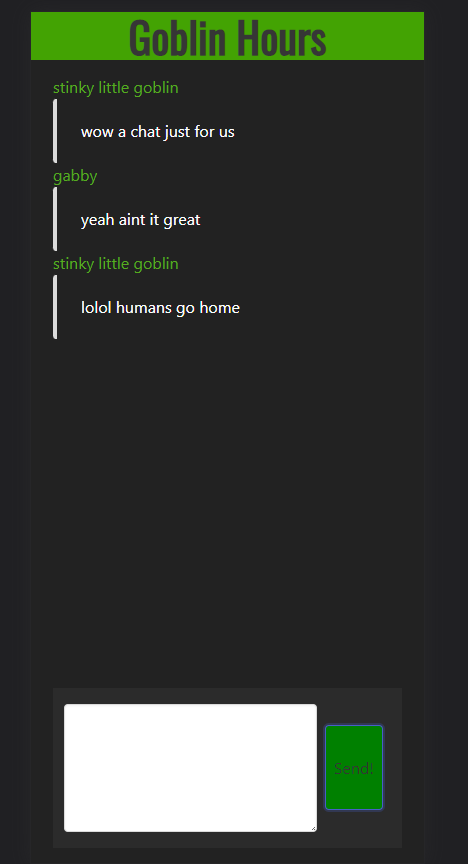

## Not-Discord/Goblin Hours

### Description

A server/client bundle for a simple text/emoji only chat service built using React, Socket.io and Express. No chat history is saved currently and the application is quite bare bones, being primarily a learning project. MongoDB support to be added later utilizing Mongoose.

### Screenshot

